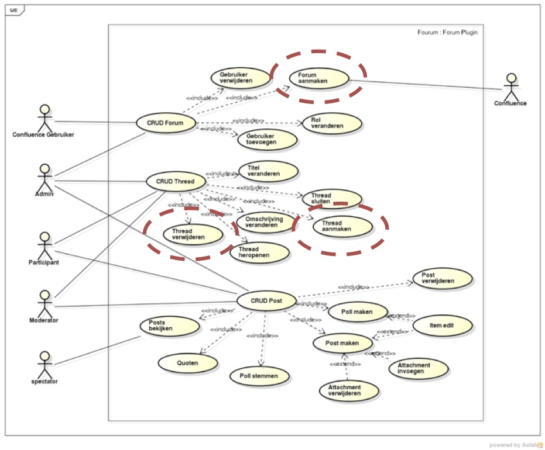
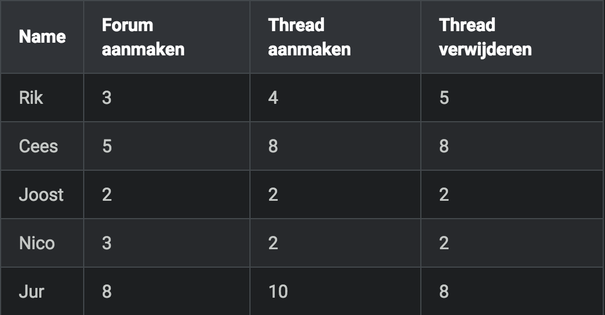

# Jira Workshops: On your way to a working scrum board

## Learning Objectives
* Create Jira Agile Scrum projects.
* Perform basic administration of a planning board (workflows, columns and time tracking).
* Create tasks and subtasks
* Create and manage a product backlog based on tasks (e.g. features, user stories, use cases)
* Create and manage a sprint backlog
* Estimate and re-estimate work
* View reporting like burndowns

## Steps

1. Create a new project of projecy type "Agile Scrum" with the name "Workshop" and the key "WOR".
2. Normally a Jira Agile Scrum project has a standardized workflow with the swimlanes To Do, In Progress and Done. We're going to add at least an extra swimlane but that requires a _simplified workflow_.

  Navigate to Board->Configure and click on "Columns". Click on the button "Simplify Workflow", then click "Next" and "Simplify" and finally "Acknowledge". Now click on the "Add Column" and name it "To Review". Go back to your board and click on "Work" and check to see if the "To Review"-column appears.

  > __Note:__ To simplify a workflow you need global administrator permissions. You might need to contact an administrator in a "live" environment to simplify your workflow.

  > __Note 2:__ Jira has to types of administrators: global administrators and board administrators. When working in a team it's easy to let all your team members manage the board: Navigate to Board->Configure and click on the pencil behind "Administrators". Add your group name (e.g. grp-Verkeersplein6) here and every member of this group can manage the board.

3. Before we can use Jira for our product backlog and sprint backlog we have to perform some last configuration to be able to see some nice reporting (e.g. the burndown). Navigate to Board->Configure and click on "Estimation". Click on "Estimation Statistic" and and select "Original Time Estimate". Set "Time Tracking" to "Remaining Estimate and Time Spent".

4. In a standard Jira installation issues of type "Task" do not have field/property for the "Story Points". Let's add this property: Go to the "cog" in the right upper corner of your screen and open Jira's administration, click on "Issues". Navigate on the left to Fields->Custom Fields and you'll see that the field "Story points" is only available for issues of type "User Story" and "Epic". Click on the cog on the right of the Story Points line and select "Configure". Select the link 	"Edit Configuration" right of "Applicable contexts for scheme". In the section "Choose applicable issue types" select Epic, Story and Task.

  > __Note:__ We've just added the field to issues of type "Task" but we can't edit this field in a screen until we modified the "Field Screen". In the field administration screen navigate to Screens->Screens and click on the "Configure"-link next to the "Default Screen". At the bottom of the screen Select the Story Points field and add the field to the screen. Drag the field-description up, just below "Issue Type".  

5. Let's create the product backlog. Go back to "Plan"-mode. The product backlog will be created using issues of type "Task".

  > __Note:__ A task relates to a feature expressed in the language of the customer (product owner), e.g. a user story, feature of use case. In this workshop we are going to use a use case diagram to build our product backlog:

  

  Suppose we're starting a project and the project team did a planning poker session:

  

6. Use the Blue(-ish) "Create"-button to create 3 issues of type "Task" with the Use case title as the Summary and Description. You might have noticed the difference in the estimations of the team members. After a short discussion they agreed to take the average, but that's not a standard procedure! Take the average of the team members estimation per task as a value for the "Story Points". Leave the rest of the fields empty, _including_ the "Original Estimate" and "Remaining Estimate".

  > __Note:__ We end up with a small product backlog that is big enough for our workshop. Normally this backlog is a lot larger and descending ordered by priority.

7. After a meeting with the product owner the team agreed to build the first two tasks (_Forum aanmaken_ and _Thread aanmaken_) in the upcoming sprint. Their gut feeling (that's all you have in the start of a project) tells them it's OK to have workitems worth a total of 10 story points. Note: story points are a relative estimation and specific for the team and the project. You should not compare these points with other teams or other projects, it's like comparing apples and oranges or maybe even apples and bikes.

  Create a new Sprint (there is a "Create Sprint"-button :wink:). Drag the two tasks to Sprint 1. Do _not_ start the sprint yet. We only have two quite big tasks on our sprint backlog, that's not enough to create workitems for our team that has 5 members, so we need a different type and level of issues!

8. For every task: select it in the planning board and click on the (...)-Button on the right and select "Create Sub-Task". Give every task 6 subtasks:

  * Write fully-dressed use case. Original Estimate: 1h.
  * Adjust domain model (Description: includes updating the glossary and documenting analysis decisions). Original Estimate: 2h.
  * Create technical design (Description: sequence diagram, class diagram and guiding documentation like explanation, motivation of design decisions and used design patterns). Original Estimate: 4h.
  * Write unit-tests. Original Estimate: 3h.
  * Implement happy flow. Original Estimate: 2h.
  * Implement alternative flows. Original Estimate: 3h.

9. Time to start the Sprint! Go to the Plan-section of the planning board and click on "Start Sprint". Don't change the start date and end date, that's OK for now.

  > __Note__: When you start the sprint before adding (sub)tasks the burndown cannot be shown: a burndown shows given a start and end-date the burn of time/effort for a set of tasks. When you start a sprint without tasks there's nothing to burn. There is an option to "burn up" (instead of "burn down") but Jira cannot create a trend line in that situation. So, first create workitems for your sprint and  second start the sprint.

  > __Note 2__: We have workitems worth 10 story points and 4 days. Our team has 5 members so we should have a set of workitems worth 5 * 5 d = 25 days = 200 hours. Given a productivity of 50%, the rest of the time is for meetings, planning, feedback etc.

10. Ready to sprint! But wait, let's first see how our burndown look like. Click on the "Report"-button. A nice graph shows a pile of work having 14 issues with a total time of 3 days and 6 hours. Weekend days are grayed out in this report but you can modify that in the board configuration: Configuration->Working Days.

11. Now we are really really ready to sprint :grin:. Drag "Write fully-dressed use case" to "In progress", next drag it to "To review". Start dragging the item to "Done", two sub-statuses appear: Resolved and Closed. We use Closed in this workshop, if you want to know more visit [Atlassian Answers](https://answers.atlassian.com/questions/54749/resolved-vs-closed-what-is-the-purpose-of-two-final-states-in-the-default-workflow). The remaining estimate is still 1h, we forgot to log our work! Drag the item back to "To Review", click the "Log Work" link and set the "Time Spent" field to 1h. Next, drag the item to Done.

12. Pay a short visit to the Reporting section and notice that the Remaining values are decreasing and Time Spent is increasing. A bit faster than expected but hey, we doing a workshop, time = money :wink:.

  > __Note:__ In real projects time goes a lot slower but take your time to log your work: at least at the end of your work day but even better, every time you take a short break or when you have a major status improvement for your task.

13. Drag all remaining sub tasks to "In progress". When adjusting the Domain Model the assigned developer ends up in a long discussion with his team. Log 2 hours of work for this workitem, put "Team discussion" in the "Work Description"-box  and use the existing estimate of 2 hours for the "Remaining Estimate". Next, log 2 hours of work and drag the workitem to Done.

  > __Note:__: In real projects the burndown shows a spike in the graph due to the re-estimation of the Domain Model.

14. Drag all sub tasks for one of the tasks to Done and set the Remaining Estimate to 0h. A dialog appears when the last sub task is dragged to Done: Update Parent Issue. Select "Closed" for the transition value. Repeat this steps for all sub tasks for the remaining task. We can now complete the Sprint. Navigate to "Work"-mode and click on the small triangle next to the name of the sprint in the upper left corner. Click on "Complete Sprint". The Sprint Report appears, but for a short workshop it does not contain any useful information.

15. You've learned how to create and manage a Jira Agile board and to use it as a product backlog and sprint backlog.

  > __Note:__ For this specific situation we planned work for 10 story points and it looks like we managed to complete the sprint in time. Let's say it was a nice fit and the estimations of the subtasks were fine. So 10 story points equal 4 days (32 hours) of work, a velocity of 3.2 hour per story point. We now know that we can handle this specific amount of story points, so we should plan this amount of story point for the upcoming sprint too. When it was not a nice fit at all, use your retrospective to figure out what went wrong and take a different (more/less) amount of story points for the next sprint.

  For HAN University projects like [OOSE](http://wiki.icaprojecten.nl/display/WEB/Home) this workshop should be enough. If you want to learn more, visit any of the following resources:
  * [Jira Agile User's Guide](https://confluence.atlassian.com/agile/jira-agile-user-s-guide)
  * [PluralSight course: Scrum Development with Jira & JIRA Agile](https://app.pluralsight.com/library/courses/scrum-development-jira-agile/table-of-contents)
  * [Tutorial on Atlassian Jira Agile Tool](https://www.youtube.com/watch?v=TKymhkMWLWA)
  *  [Configuring Estimation and Tracking](https://confluence.atlassian.com/agile/jira-agile-user-s-guide/configuring-a-board/configuring-estimation-and-tracking)
